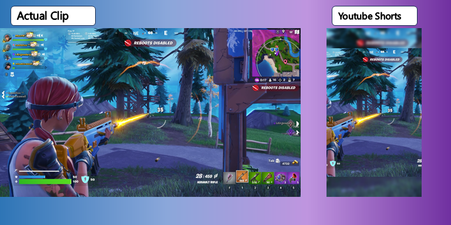

# Gaming Clip Processor

A Python script that processes gaming kill cam videos into formats suitable for YouTube Shorts and Twitter. The script adds blur effects, maintains aspect ratios, and automatically adds outro videos to your clips.

## Features

- Processes videos for both YouTube Shorts (9:16 aspect ratio) and Twitter
- Adds a blurred background effect for YouTube Shorts
- Automatically adds outro videos
- Archives processed input files
- Maintains high video quality with configurable bitrate
- Handles batch processing of multiple videos

## Sample Results

```
samples/
├── input/
│   └── sample_killcam.mp4     # Original gaming clip
├── outros/
│   ├── youtube_outro.mp4      # Sample YouTube outro
│   └── twitter_outro.mp4      # Sample Twitter outro
└── output/
    ├── youtube/
    │   └── YouTube_sample_killcam.mp4    # Processed YouTube Short
    └── twitter/
        └── Twitter_sample_killcam.mp4    # Processed Twitter version
```

### Before & After


## Requirements

- Python 3.8+
- See `requirements.txt` for Python package dependencies

## Installation

1. Clone this repository:
```bash
git clone https://github.com/yourusername/gaming-clip-processor.git
cd gaming-clip-processor
```

2. Install required packages:
```bash
pip install -r requirements.txt
```

## Usage

```bash
python video_processor.py --input-dir /path/to/input/videos \
                         --output-dir /path/to/output \
                         --archive-dir /path/to/archive \
                         --twitter-outro /path/to/twitter_outro.mp4 \
                         --youtube-outro /path/to/youtube_outro.mp4
```

### Arguments

- `--input-dir`: Directory containing your input MP4 videos
- `--output-dir`: Base directory where processed videos will be saved (separate YouTube and Twitter folders will be created)
- `--archive-dir`: Directory where input videos will be archived after processing
- `--twitter-outro`: Path to the outro video for Twitter uploads
- `--youtube-outro`: Path to the outro video for YouTube Shorts

### Sample Directory Structure
```
project_root/
├── video_processor.py
├── requirements.txt
├── README.md
├── samples/
│   ├── input/
│   │   └── sample_killcam.mp4
│   ├── outros/
│   │   ├── youtube_outro.mp4
│   │   └── twitter_outro.mp4
│   └── output/
│       ├── youtube/
│       └── twitter/
├── input/
├── output/
│   ├── youtube/
│   └── twitter/
└── archive/
```

### Output Structure

The script will create the following directory structure in your output directory:
```
output_dir/
├── youtube/
│   └── YouTube_video1.mp4
└── twitter/
    └── Twitter_video1.mp4
```

## Video Specifications

### YouTube Shorts
- Resolution: 1080x1920 (9:16 aspect ratio)
- Codec: H.264
- Bitrate: 50Mbps
- Effects: Blurred background with centered overlay

### Twitter
- Original aspect ratio maintained
- Codec: H.264
- Bitrate: 50Mbps

## Contributing

Feel free to submit issues and enhancement requests!

## License

This project is licensed under the MIT License - see the LICENSE file for details.
